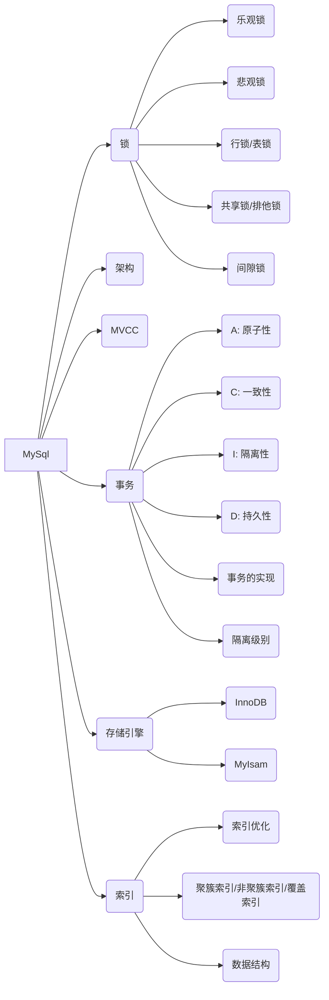

## 锁

### 1. MySQL  锁的作用？

当数据库有并发事务时，可能会出现数据不一致问题。通过锁的机制保障访问顺序，避免数据不一致的情况

### 2. MySQL  的锁有哪些？[参考](https://zhuanlan.zhihu.com/p/29150809)

根据类型划分：共享锁、排他锁

* 表共享锁：允许其他事务对该表执行查询，阻止其他事务执行更新操作
* 表排他锁：阻止其他事务执行查询、更新操作

根据作用的范围：行锁、表锁

* MyISAM：表锁，不适合有大量更新操作，因为表锁更新操作出现阻塞的情况较多
* InnoDB：行锁 (⚠️ 行锁是通过给索引上的索引项加锁来实现的，如果未使用索引将通过表锁)

行锁实现的方式：乐观锁、悲观锁

### 3. InnoDB的间隙锁？

当使用范围查询条件时，InnoDB 会给符合条件的已有数据记录的索引项加锁；对于键值在条件范围内但并不存在的记录，叫做“间隙（GAP)”，InnoDB也会对这个“间隙”加锁，这种锁机制就是所谓的间隙锁。

* 通过间隙锁避免幻读问题

* 满足恢复与复制的需要

### 4. 死锁的产生原因，MySQL 的解决方法

原因：指两个或多个事务在同一资源上相互占用，并请求锁定对方占用的资源，从而导致恶性循环。

**检测死锁**： innoDB存储引擎能检测到死锁的循环依赖并立即返回一个错误。

**死锁恢复：**将持有最少行级排他锁的事务进行回滚

## MVCC

>   是什么？做什么的？[参考](https://draveness.me/database-concurrency-control/)

MVCC：并发控制机制，数据库在并发性能和可串行化之间做的权衡和妥协。

**并发控制**

* 悲观并发控制：读写锁
* 乐观并发控制：基于时间戳的协议
* 多版本并发控制：每一个写操作都会创建一个新版本的数据，读操作会从有限多个版本的数据中挑选一个最合适的结果直接返回

## 事务

### 1. 事务的特性？

A：原子性

C：一致性 (总是从一个一致性的状态转换到另外一个一致性的状态)

I：隔离性 (一个事务的修改在最终提交前，对其他事务是不可见的)

D：持久性 (一旦事务提交，所做的修改就会永久保存到数据库中)

### 2. MySQL 事务依靠什么来实现？

A：通过 undo log 实现，记录了需要回滚的日志信息，当发送事务回滚是撤销已经执行的 SQL 语句

C：代码层面来保证

I：锁机制来实现，通过MVCC来提升读的性能

D：通过内存 + redolog 实现，mysql修改数据同时在内存和redo log记录这次操作，事务提交的时候通过redo log刷盘，宕机的时候可以从redo log恢复

### 3. MySQL  的隔离级别分别是什么？[参考](https://draveness.me/mysql-innodb/)

* Read Uncommit (读取未提交)：脏读
* Read Commit (读取已提交)：不可重复读
* Repeatable Read(可重复读)：幻读
* Serial (序列化访问)：事务安全

## MySQL 的架构？

应用层：连接器、缓存、分析器、优化器、执行器

存储引擎：InnoDB

> InnoDB  VS  MyIsam

InnoDB： 支持事务、行锁，不支持外键，聚簇索引

MyIsam：不支持事务，表锁，外键，非聚簇索引

> 外键是什么？

通过定义外键约束，关系数据库可以保证无法插入无效的数据。由于外键约束会降低数据库的性能，大部分互联网应用程序为了追求速度，并不设置外键约束，而是仅靠应用程序自身来保证逻辑的正确性。

## 索引

MySQL  的索引有哪些？

根据**数据结构**划分

* B+  树索引，支持范围、排序，减少随机 I/O次数，提升性能

* Hash 索引，查询速度快，不支持范围、排序

聚簇索引

* 叶子节点包含数据

非聚簇索引

* 叶子节点只有指针指向数据

> 覆盖索引和回表吗？

覆盖索引，由于 InnoDB 使用聚簇索引，如果使用的索引中包含所有查询的数据，则称为覆盖索引。如果缺少数据，需要根据主键，再进行一次查询，则称为回表

> InnoDB  为什么选择 B+ 树作为数据结构

原因：

- InnoDB 需要支持的场景和功能需要在特定查询上拥有较强的性能；
  - 哈希索引处理范围查询、排序时性能很差，会进行全表扫描
  -  B 树和 B+ 树虽然在单数据行的增删查改上需要 `O(log n)` 的时间，但是它会将索引列相近的数据按顺序存储，所以能够避免全表扫描
- CPU 将磁盘上的数据加载到内存中需要花费大量的时间，这使得 B+ 树成为了非常好的选择
  - B 树能够在非叶节点中存储数据，但是这也导致在查询连续数据时可能会带来更多的随机 I/O，而 B+ 树的所有叶节点可以通过指针相互连接，能够减少顺序遍历时产生的额外随机 I/O

> 如何涉及好的索引？ (索引优化) [参考](https://draveness.me/sql-index-intro/)

选择过滤因子小的索引列在前面

**三星索引**

* 减少索引的列，减低随机 I/O 的次数
* 第二颗星用于避免排序，减少磁盘 IO 和内存的使用
* 避免回表查询，直接在索引列上获取全部数据

