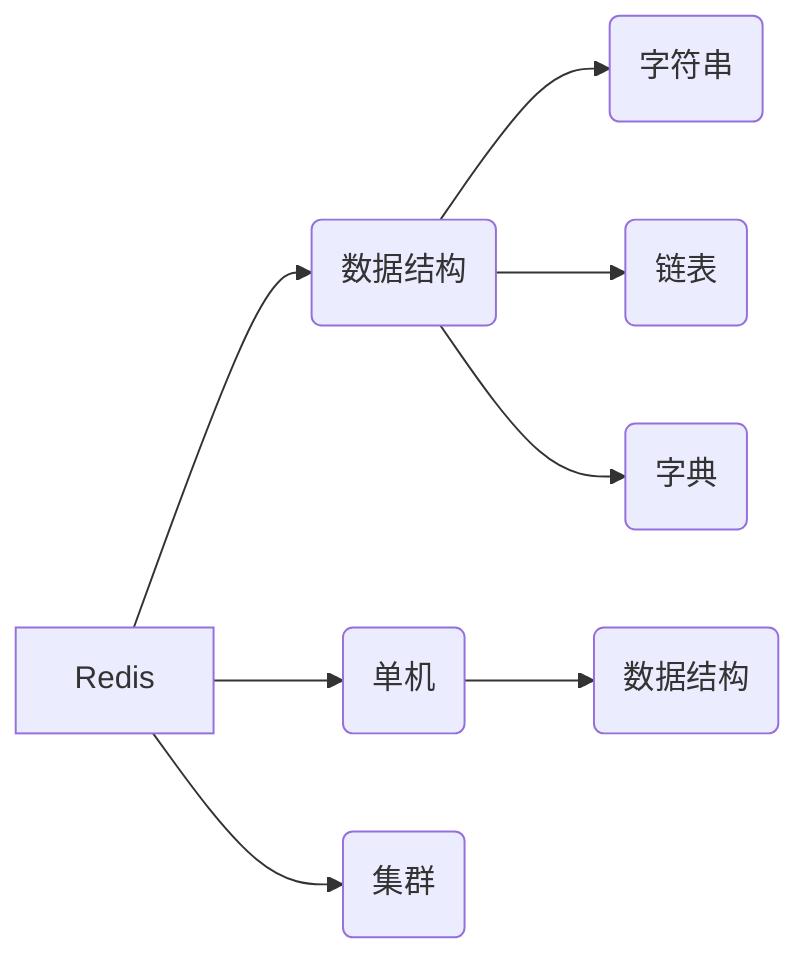

> Redis 高性能的非关系数据库，支持单机 10W 的 QPS
>
> 优点：高性能、支持持久化、灾备恢复
>
> 缺点：受限内存、一致性
>
> 解决问题：通过高性能的特性快速返回数据，提升用户体验。通过高并发的特性保护数据库，避免被打挂

# 数据结构

在线体验平台：[链接](https://try.redis.io)

## 基本数据结构

### 字符串 (string)

基于 C 字符串重新定义了字符串的数据结构 SDS (simple dynamic string，简单动态字符串)

包含字符串长度与字符数组

优点：

* 减少修改字符串长度时所需的内存重分配次数
* 获取字符串长度 o(1) 复杂度
* 二进制安全

### 链表 (list)

双向链表，具有头尾指针，节点数量等字段提高性能

优点：方便元素的插入与删除

缺点：不支持随机访问

### 字典 (hash)

“使用哈希表作为底层实现，每个字典带有两个哈希表，一个平时使用，另一个仅在进行rehash时使用。

### 跳跃表 [参考](https://zhuanlan.zhihu.com/p/53975333)

有序数据结构，它通过在每个节点中维持多个指向其他节点的指针，从而达到快速访问节点的目的

跳跃表支持平均O（logN）、最坏O（N）复杂度的节点查找，还可以通过顺序性操作来批量处理节点

数据结构，通过索引的方式，定位到原来链表的范围，从而提高效率

目的，提高查找与插入效率

### 压缩列表

列表键只包含少量列表项，并且每个列表项要么就是小整数值，要么就是长度比较短的字符串，那么Redis就会使用压缩列表来做列表键的底层实现。

目的：节约内存

## 对象

基于引用计数技术的内存回收机制

* 字符串对象
* 列表对象
* 哈希对象
* 集合对象 (set)
  * 特点：无序集合，可以进行集合的交集、并集操作
* 有序集合对象 (sorted set)
  * 特点：增加权重参数 score，可以对集合中的元素进行排队
* 

# 单机数据实现

## 1. 数据结构 [参考](./资料/Redis 单机实现.md)

* redisServer
* redisDb
* eventLoop 

## 2. 单线程模型

Redis 基于 Reactor 模式开发了高效的事件处理模型 (文件事件处理器)。通过单线程循环接受事件，调用事件处理器进行处理。因此我们说 Redis 是单线程的方式运行。

> Redis 基于 Reactor 模式开发了自己的网络事件处理器：这个处理器被称为文件事件处理器（file event handler）。文件事件处理器使用 I/O 多路复用（multiplexing）程序来同时监听多个套接字，并根据 套接字目前执行的任务来为套接字关联不同的事件处理器。
>
> 当被监听的套接字准备好执行连接应答（accept）、读取（read）、写入（write）、关 闭（close）等操作时，与操作相对应的文件事件就会产生，这时文件事件处理器就会调用套接字之前关联好的事件处理器来处理这些事件。
>
> **虽然文件事件处理器以单线程方式运行，但通过使用 I/O 多路复用程序来监听多个套接字**，文件事件处理器既实现了高性能的网络通信模型，又可以很好地与 Redis 服务器中其他同样以单线程方式运行的模块进行对接，这保持了 Redis 内部单线程设计的简单性。

## 3. I/O  多路复用

Redis 通过 I/O 多路复用监听客户端的请求，它会将感兴趣的事件注册到内核中，监听事件是否发生。

优点：不需要额外创建多余的线程监听客户端的大量链接，降低资源的消耗

## 4. 多线程

> Redis 是不是只有单线程？

虽然 Redis 是单线程模型，但是在 4.0 版本就加入了多线程的支持，比如对一些大键值对的删除操作，通过多线程异步处理。

> 使用单线程模型的原因：

1. 单线程模型简单方便维护
2. Redis 的性能瓶颈不是在 CPU 上，主要在网络与内存
3. 多线程会引起死锁、线程安全、上下文切换的问题，升值影响性能

> Redis  6.0 后加入多线程原因

利用多线程提高网络 I/O 的读写性能，但是后续的操作还是通过单线程模型执行

## 5. 缓存过期

> 配置过期时间的原因

Redis 是基于内存的数据库，配置缓存的有效期，可以提高内存的利用率，减少内存的消耗

> Redis 如何判断数据是否过期

redisDB 中维护过期字典，过期字典的 key 是过期数据的 key，过期字典的 val 是 过期的时间戳

> 过期数据的删除策略

1. 定期删除：在时间事件中，选择一批 key 执行删除操作。对 CPU 不友好，节约了内存
2. 惰性删除：在访问到过期的键时，执行删除操作。对 CPU 友好，浪费部分内存
3. 主从复制数据过期：主节点数据过期删除时，AOF 添加 DEL 日志，同步到从节点，删除从节点数据。不一致的情况，通过从节点时间戳比较

> 内存淘汰机制

当 Redis 内存不足时，会执行内存淘汰机制

* volatile-lru：配置过期时间中选择最近最久未使用
* volatile-ttl： 配置过期时间中选择将要过期的数据
* volatile-random: 配置过期时间中随机淘汰
* allkey-lru：所有键值中选择最近最久未使用
* allkey-random：所有键值中随机删除

## 6. 持久化

通过持久化机制，将内存数据写入磁盘，当重启机器，机器故障后，可以进行数据恢复操作

* RDB (快照持久化)
  * 通过定时创建快照获取内存中某个时间点数据的副本。可以将副本持久化到本地，也可以进行主从备份同步到副本
  * 持久化过程：
    * SAVE：阻塞进程，等待 RDB 文件创建完成
    * BGSAVE：派生出一个子进程，然后由子进程负责创建RDB文件，服务器进程（父进程）继续处理命令请求
  * 优点：适合灾难恢复，速度比 AOF 快
  * 缺点：不是实时备份数据，通过 fork 子进程备份数据，耗时
* AOF (日志持久化)
  * 记录每一条变更数据的命令，将命令写入 AOF 文件
  * 优点：实时性强，支持追加的方式
  * 缺点：体积过大，恢复时间较长

## 7. 事务

Redis事务提供了一种将多个命令请求打包的功能。然后，再按顺序执行打包的所有命令，并且不会被中途打断。

redis 的事务不支持原子性，不支持持久性

# 集群数据库实现

## 主从复制

主节点：负责数据的读/写

从节点：负责数据的读，数据的同步

全量同步：

1. 从节点启动，像主节点发送 SYNC 命令
2. 主节点收到 Sync ，执行 bgsave 命令创建快照，通过缓冲区记录此后的写命令
3. 快照执行完成，将快照/缓冲区命令同步给从节点，期间写命令同样记录缓冲区
4. 主节点快照发送完毕，从节点载入快照。完成后接受缓冲区命令，更新数据

增量同步：

通过复制偏移量与缓冲区实现，根据从节点的复制偏移量判断操作日志是否在缓冲区中，存在的情况下同步给从节点，实现增量同步

## 哨兵模式

> 为什么需要哨兵模式？

原因：假如主节点异常，需要手动需求客户端配置，并重新发布/连接。无法保证服务的高可用。

> 哨兵模式工作过程？

1. 哨兵每秒向集群中的节点：master、salver、哨兵，发送 ping 命令
2. 如果实例响应 ping 命令超时，将被哨兵标记为主观下线
3. 如果某个 master 节点被标记为下线，其他的哨兵也进行确认是否下线，如果数量达到，该节点将被下线，并且选择某一个 slave 作为新的 master，并且通知其他从服务器修改配置，切换主节点连接
4. 客户端在 master 发送故障后，会向哨兵请求新的 master 地址，哨兵将返回新的主节点地址

> 主节点选举的规则是？

1. 选择健康的从节点
2. 选择偏移量大的从节点

> 哨兵选择领导的算法？

Raft 算法

## 集群模式

> 集群模式解决的问题？

在线扩容困难

通过哈希槽的模式，方便在线扩容。

# 问题

## 数据一致性

出现数据不一致的场景：先删除缓存，在更新 DB。另外的线程访问数据，导致获取到未更新前的数据，导致不一致

1. 先删除缓存
2. 更新数据库
3. 延期再删除缓存

## 缓存雪崩

> 缓存雪崩：设置了相同过期时间导致某时间缓存集体失效，导致请求落到数据库中

解决方案：

设置随机的过期时间

## 缓存穿透

> 缓存穿透：访问大量不存在的 key，由于缓存数据不存在，请求直接到数据库中

解决方案：

1. 缓存无效的 key
2. 通过布隆过滤器过滤掉肯定不存在的数据

# 分布式锁

## 单节点分布式锁

通过 `setnx` 命令，当 key 不存在时设置值，配置过期时间，返回成功。当 Key 存在时返回失败。可以通过 val 配置版本号，防止误删操作

## 集群分布式锁

> Redlock，通过集群的方式保证高可用性