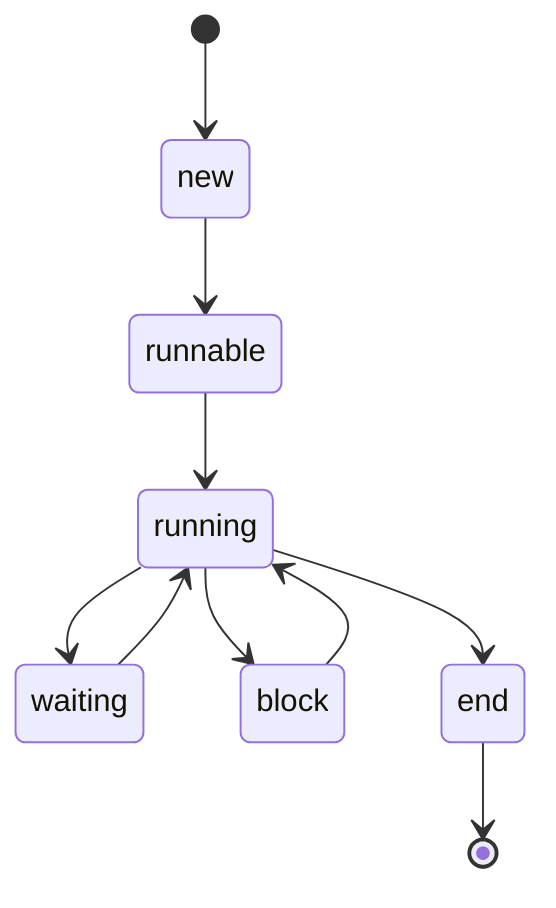
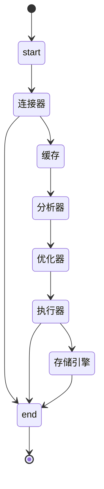

## 基础

### HashCode

> - [ ] hashCode的作用？hashCode相等的两个对象一定相等吗？equals呢？反过来相等吗？

主要：用于查找的便利性，比如： HashMap 中查找存储的位置

### 同步类容器和并发类容器

> - [ ] 同步类容器：使用 synchronized 实现的容器。保证同一时刻只有一个线程使用容器

* stack
* hashtable
* vector
* Collections.syncronizedXXX

> - [ ] 并发容器：解决同步容器性能低的问题，通过同步的机制实现并发容器，提高吞吐量。同一时刻允许多个线程并发访问，保证线程安全

* CocurrentHashMap
* CopyOnWriteArrayList

### ConcurrentHashMap [参考](https://mp.weixin.qq.com/s/AHWzboztt53ZfFZmsSnMSw)

> - [ ] 老版本数据模型与实现

分段锁提高并发性，RentranceLock

> - [ ] 新版本数据模型与实现

CAS + Syncronized 实现，进一步提高并发性

> - [ ] 为什么 `get()` 不需要加锁？

通过 volatile 保证内存的可见性

> - [ ] 为什么取消分段锁的设计

1. CAS 在每个链表头上进行加锁，提高了并发度
2. 分度锁需要继承 AQS 实现，增加了内存的开销

### CopyOnWriteArrayList

> - [ ] 数据结构

数据结构：ReentrantLock + 复制数组

特点：读写分离，读的操作不需要加锁，适合读多写少的场景

缺点：只有最终一致性，没有实时性

> - [ ] 为什么 COW 具有最终的一致性。为什么 ConcurrentHashMap  只有弱一致性 [参考](https://juejin.cn/post/6844903602436374541)

volatile  加在数组上，导致元素的变化不可见。

### 线程池

> - [ ] 线程池都有哪些参数？

coreThreadSize、maxThreadSize、BlockQueue、keepAliveTime、RejectHandler

> - [ ] 介绍一下Executors提供的四种线程池？

| Executors              | coreSize | maxSize     | BlockQueue            | keepAliveTime | RejectHandler |
| ---------------------- | -------- | ----------- | --------------------- | ------------- | ------------- |
| newCachedThreadPool    | 0        | MAX_INTEGER | SynchronousQueueBlock | 60s           | AbortHandler  |
| newFixedThreadPool     | n        | n           | LinkedBlockingQueue   | 0             | AbortHandler  |
| newSingleThreadPool    | 1        | 1           | LinkedBlockingQueue   | 0             | AbortHandler  |
| newScheduledThreadPool | 0        | MAX_INTEGER | DelayBlockQueue       | 0             | AbortHandler  |

> 线程数设置多少比较合理？

* CPU密集型：线程个数为CPU核数。这几个线程可以并行执行，不存在线程切换到开销，提高了cpu的利用率的同时也减少了切换线程导致的性能损耗

* IO密集型：线程个数为CPU核数的两倍。到其中的线程在IO操作的时候，其他线程可以继续用cpu，提高了cpu的利用率 

- CPU密集型任务:  主要是执行计算任务，响应时间很快，cpu一直在运行，这种任务cpu的利用率很高
- IO密集型任务：主要是进行IO操作，执行IO操作的时间较长，这是cpu出于空闲状态，导致cpu的利用率不高

> 什么情景下使用多线程？

* 高并发场景下，当个请求并发获取多个数据，可以通过线程池优化

> 突然断电了，线程池会怎么样？

阻塞队列持久化，正在处理事物控制。断电之后正在处理的回滚，日志恢复该次操作。服务器重启后阻塞队列中的数据再加载

> 线程池任务调度机制 `ThreadPoolExecutor.excute()`

* workerCount < corePoolSize：新增工作线程执行
* workerCount >= corePoolSize && 阻塞队列未满：添加任务到阻塞队列
* 阻塞队列已经满 && workerCount < maxPoolSize：新增工作线程并执行
* 执行拒绝策略

> 线程池任务缓存策略 `BlockQueue`

线程池中是以生产者消费者模式，通过一个阻塞队列来实现的。阻塞队列缓存任务，工作线程从阻塞队列中获取任务。。

> 线程任务申请 : `Worker.getTask()`

> 线程池回收

线程池中线程的销毁依赖JVM自动的回收，线程池做的工作是根据当前线程池的状态维护一定数量的线程引用，防止这部分线程被JVM回收，当线程池决定哪些线程需要回收时，只需要将其引用消除即可。通过 HashSet 存储引用。

### 内存区域

> 1.8 以前的内存布局

线程共享

* 堆：存放对象实例，几乎所有的对象实例以及数组都在这里分配内存。开启逃逸分析，如果某些方法中的对象引用未逃逸出去，那么对象可以直接在栈上分配内存。

* 方法区：存储已被虚拟机加载的类信息、常量、静态变量、即时编译器编译后的代码等数据
  * 运行池常量池

线程间不共享

* 虚拟机栈：描述方法执行的内存模型，方法执行到完成的过程对应栈帧在虚拟机栈入栈与出栈的过程。栈帧包括：局部变量表、操作数栈、动态连接、方法出口等
* 本地方法栈
* 程序计数器：行号指示器，用于指示当前线程所执行的字节码的行号，在多线程的执行时在结束后回到当前线程执行的位置

> 1.8 及以后

线程间共享

* 堆
* 元空间

线程间不共享

* 虚拟机栈
* 本地方法栈
* 程序计数器

### java对象在内存中的结构划分？

* 对象头：(1) 运行时数据：GC 年龄、HashCode、锁状态 (2) 类型指针，指向类元数据指针 
* 实例数据：对象中定义字段的实际内容
* 对齐数据

### Synchronized [参考](https://crossoverjie.top/2018/01/14/Synchronize/)

> 简述synchronized Object Monitor机制？

背景：synchronized 实现的原理，通过 JVM 在编译的时候，在同步方法前后插入：monitor.enter 与 monitor.exit 指令。本质上通过对象监视器( Monitor ) 进行获取实现，获取过程具有排他性，每一个时刻只有一个线程可以执行。没有获取到的线程会进入同步队列，等其他线程退出的时候重新获取 Monitor。

> ObjectMonitor 数据结构？

owner：持有当前对象监视器的线程

EntryList：处于 Block 状态的线程列表

WaitList：处于 Wait 状态的线程列表

> synchronized和Lock接口的区别？

| 锁           | 中断   | 自动解锁 | 实现        | 公平   |
| ------------ | ------ | -------- | ----------- | ------ |
| Synchroniezd | 不支持 | 是       | JVM         | 非公平 |
| Lock         | 支持   | 否       | Java ·  AQS | 可配置 |

> synchronized的优化？[参考](https://tech.meituan.com/2018/11/15/java-lock.html)

通过：无锁 -> 偏向锁 -> 轻量级锁 -> 重量级锁来减少锁竞争带来的上下文切换。

无锁：没有对资源进行锁定，所有的线程都能访问并修改同一个资源，但同时只有一个线程能修改成功

偏向锁：同一线程重复进入锁自动获取资源，通过判断对象的 Mark Word 是否存储当前线程的偏向锁，避免通过 CAS 获取锁与释放锁

轻量级锁：在另外一个线程竞争锁时，通过 CAS 修改对象头。如果修改成功，替换线程 ID，依旧保持偏向锁。如果修改失败，升级为轻量级锁。其他线程会通过自旋的形式尝试获取锁，不会阻塞，从而提高性能。

重量级锁：通过多次自旋 CAS 竞争锁失败后，升级为重量级锁。为获取到锁的线程，在阻塞队列中等待

### 谈谈ThreadLocal的作用？底层如何实现的？会不会导致内存泄露？

> - [ ] 作用：每个线程有自己的专属变量

> - [ ] 底层实现：

每个线程具有一个 Map，键为 ThreadLocal 对象，值为对应的值。存储的时候，先获取 Map，然后调用 Put 方法进行设置。调用的时候，获取线程的 Map，已 ThreadLocal 为键进行获取

> - [ ] 是否会导致内存泄漏? [参考](https://developer.aliyun.com/article/614391)

Map 的键通过弱引用解决内存泄漏。但是 Value 可能存在内存泄漏，只有当引用的线程结束才会释放。

解决方案：在不使用 ThreadLocal 时调用 Remove 函数

使用场景：在我们的应用中，有个参数掉调用链上的多个方法都需要使用，就存放在 ThreadLocal 中，避免逐层透传

### 谈谈volatile的作用？实现原理以及使用场景[参考](https://www.cnblogs.com/dolphin0520/p/3920373.html)

> - [ ] 作用：(1) 内存的可见性 (2) 防止指令重排

> - [ ] 实现原理：在编译的时候加入 lock前缀指令 (内存屏障)。(1) 执行到内存屏障这句指令时，在它前面的操作已经全部完成 (2) 会强制将对缓存的修改操作立即写入主存 (2) 使其他 CPU 的缓存失效

使用场景：JedisCluster 初始化时，通过 valatile 修饰该字段，避免多次初始化。比如 ConcurrentHashMap 使用 valatile 避免读取的时候使用锁

### 简述happen-before规则？

描述：多线程共享变量的可见性。如果两个操作具有 Happen-before 的关系，前一个操作的结果对后一个操作前可见

规则：

1. 单线程执行，前一个操作对后续操作可见
2. 锁：
3. volatile
4. 线程

### 线程

> 线程的状态

`Thread.sleep(millis)`：当前线程进入阻塞状态，但不释放对象锁，时间到后自动进入可运行状态;

`Thread.yield()`：当前线程调用此方法，当前线程放弃获取cpu时间片，由运行状态变为可运行状态;

`t.join()/t.join(millis)`：当前线程调用其它线程t的join方法，当前线程阻塞，但不释放对象锁，直到线程t执行完毕或者millis时间到，当前线程进入可运行状态。

obj.wait()/obj.wait(millis)：当前线程释放对象锁，进入等待队列。依靠notify()/notifyAll()唤醒或者millis时间到自动唤醒。

notify()/notifyAll()：随机唤醒一个/所有等待该对象锁的线程，进入就绪队列等待CPU的调度；

> 为什么wait()一般建议要放在循环中？1

当线程从wait中唤醒时，那么将直接执行处理其他业务逻辑的代码，但这时候可能出现另外一种可能，条件谓词已经不满足处理业务逻辑的条件了，从而出现错误的结果，于是有必要进行再一次判断

> 什么是线程死锁？死锁如何产生？如何避免线程死锁？

线程死锁：多个线程访问竞态资源，由于相互等待对方释放资源，自己一直持有资源，导致线程无法往下执行，产生死锁。

* 竞态资源
* 相互等待
* 循环等待
* 不可剥夺

### AQS (Abstract Queued Synchronizer)

> - [ ] 简单谈谈你对CAS的认识和理解？

AQS：是一个用来构建锁和同步器的框架，它底层用了 CAS 修改共享变量 state 实现互斥访问，同时利用 FIFO 队列实现线程间的阻塞排队与唤醒。ReentrantLock、CountDownLatch 等同步工具实现同步的底层实现机制

CAS：compare and swap (比较与交换)。通过比较内存的值是否与原来的值相同来决定是否更新目标值。常用来实现乐观锁。

> AQS  实现原理

思想：如果被请求的共享资源空闲，那么就将当前请求资源的线程设置为有效的工作线程，将共享资源设置为锁定状态；如果共享资源被占用，就需要一定的阻塞等待唤醒机制来保证锁分配

### JVM [参考](https://www.modb.pro/db/26526)

> - [ ] 什么是Minor GC、Major GC和Full GC？

Minor  GC：清理年轻代

Major GC：清理老年代

Full GC：清理年轻代、老年代、元空间

> - [ ] Young GC的大概过程？

在 Eden 中通过可达性分析找到存活的对象，拷贝到 S0 

> - [ ] 哪些对象在可达性分析中标记为可达

1. 虚拟机栈中引用的对象
2. 本地方法栈引用的对象
3. 方法区静态变量、静态常量

> - [ ] 什么样的对象会晋升到老年代？

GC 年龄达到上限，大的对象也会直接晋升老年代。避免频繁拷贝

> - [ ] 垃圾回收算法都有哪些？[参考](https://xie.infoq.cn/article/9d4830f6c0c1e2df0753f9858)

* 复制与拷贝：(1) 浪费空间 (2) 对象存活较多，释放内存较少
* 标记与清除：(2) 内存空间碎片化 (2) 大量对象需要删除，效率较差
* 标记与整理：要移动大量的存活对象才能换取少量的内存空间

> 你了解的垃圾收集器？[参考](https://crowhawk.github.io/2017/08/15/jvm_3/)

并发：Concurrent ，用户线程与垃圾回收线程一起工作

并行：Parallel 多个垃圾回收线程一起工作，用户线程还是暂停

* Serial：新生代，串行，单线程垃圾回收，复制算法，STOP THE WORLD
* ParNew：新生代，多个垃圾回收线程一起工作，复制算法，STOP THE WORLD
* Parallel Scavenge ：新生代，并行，吞吐量
* Serial Old：老年代，单线程垃圾回收，标记整理算法，STOP THE WORLD
* Parallel Old：老年代，标记整理算法，并行
* CMS：老年代，并发标记与清除，**获取最短回收停顿时间**
  * 初始化标记：STOP
  * **并发标记**：
  * 重新标记：SOP
  * **并发清除**
* G1：可预测停顿时间。G1将内存划分为一个个相等大小的内存分区，回收时则以分区为单位进行回收，存活的对象复制到另一个空闲分区中。
  * **初始标记**
  * **并发标记**
  * **最终标记**
  * **筛选回收**

> 类加载机制 [参考](https://www.cnblogs.com/chanshuyi/p/the_java_class_load_mechamism.html)

**加载、验证、准备、解析、初始化、使用、卸载**

加载：根据类名从字节码文件加载到方法区，并且创建 Class 对象，对外提供对方法区的访问

验证：JVM 会对字节码进行校验，判断是否符合 JVM 规范

准备：JVM 便会开始为类变量分配内存并初始化

解析：符号引用替换成直接其在内存中的直接引

初始化：

* new关键字实例化对象的时候、读取或设置一个类的静态字、调用静态方法	

* 当初始化一个类的时候，如果发现其父类还没有进行过初始化，则需要先触发其父类的初始化。
* 当虚拟机启动时，用户需要指定一个要执行的主类（包含main()方法的那个类），虚拟机会先初始化这个主类

卸载：JVM 便开始销毁创建的 Class 对象，最后负责运行的 JVM 也退出内存

> 都有哪些类加载器? [参考](https://www.jianshu.com/p/1e4011617650)

* Bootstrap class loader：启动类加载器，是虚拟机的内置类加载器
* extension class loader：平台类加载器,负责加载JDK中一些特殊的模块
* application class loader：系统类加载器,负责加载用户类路径上所指定的类库

> 双亲委派模式

类加载器收到加载请求后，自己先不进行加载，将请求委托给父加载器，如果父加载器存在则往上委托。如果父加载器已经加载则返回成功。否则，子加载器自己加载。

作用：(1) 防止同一个类被重复加载，保障数据安全 (2) 防止修改核心类，保障执行安全

### MySQL

> 查询优化：EXPLAIN

作用：通过 explain 来分析语句的执行过程，然后分析是否使用索引，以及怎么优化查询

> 如何使用索引？

1. 选择维度高的列 (如果选择性高于 20%，性能低于全表扫描)
2. 选择维度高的列放在前面
3. 最左匹配原则
4. 复合索引的值不为 NULL，会试索引失效

> MYSQL 语句执行过程

分层：Service 层与存储引擎层

Service：连接器 、缓存 、 分析器 、 优化器 、 执行器

存储引擎：InnoDB

Select 查询过程：

>  Update 更新过程：[参考](https://juejin.cn/post/6844903827611582471)

BinLog(归档日志)：记录用户对数据库更新的SQL语句信息

RedoLog (重做日志)：支持事务

为什么需要两阶段提交

反证法。(1) 先直接提交 RedoLog，如果此时断电，由于 BinLog 丢失记录，主从同步会缺少数据。数据不一致 (2) 先提交 BinLog，如果此时断电，由于 RedoLog 丢失，无法恢复记录，但是BinLog 存在，主从同步数据不一致。

> 本地事务数据库断电的这种情况，它是怎么保证数据一致性的呢？ (事务的底层原理)

在操作之前首先会把日志文件写入磁盘，那么当突然断电的时候，即使操作没有完成，在重新启动数据库时，数据库会根据当前数据的情况进行undo回滚或者是redo前滚，这样就保证了数据的强一致性

> mysql有哪些存储引擎

InnoDB：支持事务、行锁

MyISAM：不支持事务、表锁。适合读多写少的场景

> 数据库事务的特性？事务的隔离级别有哪些?

特性：ACID

* atomic：原子性：
* consistent: 一致性
* isolate: 隔离性
* duration: 持久性

事务的隔离级别

* 读取未提交：脏读、幻读、不可重复读
* 读取已提交：幻读、不可重复读
* 可重复读：幻读
* 序列化：

MySQL InnoDB默认的隔离级别是哪个？

* 默认的隔离级别：可重复读。可以通过间隙锁算法 (Next-Key Lock 算法)支持序列化

> 索引？

索引：存储引擎中用来快速定位记录的数据结构。

常见的索引类型：

* B树索引：优点 (支持排序，范围查询)
*  哈希索引：优点(查询速度快)

> 什么是聚簇索引与非聚簇索引？

聚簇索引：叶子节点存储主键与部分数据，可以不需要二次查询。

非聚簇索引：叶子节点存储索引键值与物理地址，需要二次查询。

覆盖索引：聚簇索引中叶子节点包含需要的数据，不需要二次查询。

>  为什么InnoDB表不建议使用过长的字段作为主键？

由于 InnoDB 使用聚簇索引

(1) 辅助索引使用主键的列，导致辅助索引占用磁盘增加

(2) 缓存中存储的主键与数据减少，增加了 I/O 的次数

> 要建议用自增列做主键？自增主键可能的问题？

自增列作为主键：使用自增列作为主键，将在当前索引位置后查询记录，如果当前分页满了，会增加新的分页。形成紧凑的数据结构。每次插入都不需要移动数据，因此效率很高。

存在的问题：对于高并发工作下，因为所有的插入都发生在这里，所以并发插入可能导致间隙锁竞争。

> 数据库锁包含哪些？[参考](https://tech.meituan.com/2014/08/20/innodb-lock.html)

共享模式：共享锁、排他锁

* 共享锁：其他事务可以读，不可以写
* 排他锁：其他事务不可以读，不可以写

锁的范围：行锁、表锁

* 行锁：加锁范围小、并发度高，易发生死锁
* 表锁：加锁范围大，并发读小，不会发送死锁

使用场景：乐观锁、悲观锁

MVCC：(多版本并发控制)，通过在数据行前后插入隐藏的值，记录创建版本号、过期版本号。

* 减少读锁的使用，提高性能

间隙锁

* 在可重复读的事务级别下解决幻读

> 如何解决分库分表的主键问题？

### Redis 

> redis都有哪些数据类型

字符串、Hash、List、Set、SortSet

> 持久化的方式？

RDB：内存数据快速，缺点：定时更新、耗时、耗性能，易丢失数据

AOF：追加日志，缺点：日志文件大，恢复速度慢

> 主从复制如何实现的？

(1) 主节点将自己的数据做一份快照同步给从节点，从节点将数据从快照恢复到内存中 (2) 之后新增的数据，主节点将语句发送给从从节点，从节点进行重放

> redis的集群模式如何实现？redis的key是如何寻址的？[参考](https://segmentfault.com/a/1190000022808576)

集群模式的优点

1. 高可用性：通过主备实现故障转移
2. 可伸缩性：通过新增节点进行扩容
3. 负载均衡：分摊单个数据节点的压力

主从模式：通过复制功能，将主节点数据更新后，自动同步到从节点更新数据。

* 优点：读写分离，负载均衡
* 缺点：不具备自动容错和恢复功能

哨兵模式：通过发送命令监控主从节点的运行状态；如果主节点宕机，自动完成主从切换，并且通知其他从节点变更。

* 优点：主从自动切换、可用性与健壮性增强
* 缺点：在线扩容复杂

集群模式：通过哈希槽进性数据分片。客户端请求数据试，对 Key 映射到一个插槽中，如果插槽找到对应的节点进行操作

* 优点：多主节点、高可用、方便扩展

> 介绍一下redis的过期策略？手写一下redis的LRU代码实现？

过期策略：当键值过期后，怎样处理

* 惰性删除：当访问到键值时，如果键已经过期，删除。优点：对 CPU 友好，缺点：一直占用内存
* 主动删除：通过定时器，定期删除过期列表的键。可以平衡 CPU 与内存使用

内存淘汰策略：当内存不足是怎么样处理

* 报错
* allkeys-lru：所有 key 中删除最近最久未使用的
* allkeys-random：在所有 key 中随机删除
* volatile-lru：设置过期时间的键中根据最近最久未使用删除
* volatile-random：设置过期时间的键中随机删除
* volatile-ttl：设置过期时间的键中删除最早过期的键

LRU 实现：

* Java：HashMap + 双向列表
* Reids：随机选择多个键值， 通过时间戳比较，删除最久未更新

>Redis 的线程模型？

Redis 选择单线程模型，通过 I/O 多路复用同时处理多个客户端的连接与请求，将事件存入内存队列，通过事件分发器选择事件处理器进行处理。

> 为什么选择单线程模型？

因为 Redis 的瓶颈并不在 CPU，通过多线程带来的性能提示收益比多线程开发与维护的收益低。Redis 的主要瓶颈在 I/O，因此后续多线程的引入**只是用来处理网络数据的读写和协议解析，执行命令仍然是单线程**

> Redis  缓存穿透？

缓存穿透：当数据库查询时，如果数据不存在则不加入缓存。导致大量查询不存在的数据的请求打到数据库上。

解决方案：(1) 不存在的数据也存入缓存 (2) 布隆过滤器，过滤掉肯定不存在的数据

> 缓存击穿

缓存击穿：某个键值过期的瞬间，大量请求由于缓存不存在直接请求到 DB

解决方案：(1) 通过互斥锁，想让一个请求获取到数据并写入缓存，其他请求等待与重试 (2) 让键不过期，如果异步刷新的方式更新缓存

> 缓存雪崩：大量键值设置了相同的过期时间，导致某个时间同时失效，大量请求打到数据库

解决方案：设置随机过期时间

### 消息队列

> 为什么使用消息队列？引入消息队列有什么缺点？

通过消息队列进行解耦、削峰、异步操作

引入消息队列：系统的复杂度增加，需要考虑消息的重复、顺序等问题，以及一致性问题

> kafka、activemq、rabbitmq、rocketmq都有什么优点缺点？[参考](https://developer.aliyun.com/ask/282988)

> 消息队列如何保证高可用？以 Kafka 为例 [参考](https://time.geekbang.org/column/article/110388)

通过副本机制，提供对数据的冗余备份，实现高可用性与高持久性。

Kafka 的副本是在分区上的副本

Kafka 是怎样进行副本同步的：基于领导者的副本同步机制实现，ZK 会进行监控当发现领导者副本挂了，在追随者副本中重新选择领导者副本

* 领导者副本：处理读写请求
* 追随者副本：从领导者副本拉取消息，写入本地日志文件，实现消息同步

为什么追随者副本对外不提供读的能力？

* 提供 Read - YOU - Write，当消息生产者发送消息后，消息消费者可以读取到消息。避免消息未同步到追随者导致的异常
* 实现单调读，避免出现消息读取出现不一致

> 消息的重发补偿解决思路？消息的幂等性解决思路？

再允许重复发送消息的前提下，消费者端通过消息 ID 消费情况保证消息幂等

> 如何保证消息不丢失？[参考](https://juejin.cn/post/6844904094021189639)

* 消息生产者消息丢失
  * 订阅消息发送状态，在回调函数中收到消息发送失败后进行消息重试
* 消息消费者消息丢失
  * 通过消息者手动确认消息消费情况，保证消息被消费
* Kafka 消息丢失
  * 通过多副本机制，保证消息在多个副本中都有备份

> 如何保证消息的有序性？

Kafka 可以保证分区消费的有序性，通过将相同类型的数据发送到指定的分区保证消息消费的有序性。

### 分布式

> 为什么要将系统进行拆分? [参考](https://youzhixueyuan.com/the-principles-and-steps-of-distributed-architecture-system-resolution.html)

* 人员：方便开发
* 业务：方便运维，

> 为什么要使用分布式锁？

在高并发、分布式的环境下，保证对共享资源的互斥访问

>  使用redis如何设计分布式锁？[参考](https://xiaomi-info.github.io/2019/12/17/redis-distributed-lock/)

1. 基础方式：先根据 Key 获取数据，如果数据不存在，则设置数据获取锁。从而获取到锁。如果数据存在则自旋等待

   问题：获取与保存不是原子操作，并发环境下可能发生异常出现重复加锁

2. 进阶：通过 Reids `setnx` 语句实现，判断数据是否不存在，不存在则设置数据，并返回成功并加锁。如果已经存在则返回失败

   问题 1：由于没有锁过期机制，假设在获取锁成功后，服务挂了，会导致死锁。

   问题 2：加入锁的过期时间短于线程的执行时间，导致别的服务共同访问互斥资源

3. 高级：**RedLock** 

   解决：如果 Redis 主宕机了，这个时候从机并没有同步到这一把锁，那么机器 B 再次申请的时候就会再次申请到这把锁

   特点：高性能     缺点：不能保证 100% 正确

> 使用zk如何实现？[参考](https://kknews.cc/comic/9z28pgl.html)

通过 zookeeper 临时顺序节点实现。当一个服务尝试获取锁时，在 zk 中添加临时节点，然后判断自己是不是第一个节点，如果是第一个节点则获取锁成功，在执行完任务后删除对应的临时节点。如果不是第一节点则订阅前一个节点的状态

​        优点：强一致性  缺点：有较多的客户端频繁的申请加锁、释放锁，ZK 集群压力较大

> 为什么要使用分布式事务？

* 介绍 ＣＡＰ原则

  在分布式系统中，Consistency (一致性)、Availability (可用性)、Patition tolerance (分区容错性) 三者不可兼容。并且由于在分布式系统中 P 是不可避免，因此只能 CA、CP

* 2PC (两阶段提交)

  * 缺点：同步阻塞、单点故障、数据不一致

* TCC [参考](https://www.cnblogs.com/jajian/p/10014145.html)

### Spring 

> Servlet生命周期?

* Servlet 是一个框架用来扩展服务器的能力，提供 Web 请求与响应的能力。
* 生命周期 [参考](http://c.biancheng.net/view/8037.html)
  1. 初始化 (init)：客户端调用 Servlet 、容器初始化的时候
  2. 服务(service)：客户端访问 Servlet 时，都会调用
  3. 销毁 (destroy)：让容器退出时 

> Spring中Bean的生命周期和作用域各是怎样的？

Bean 的生命周期：是指 Bean 从创建、初始化、销毁的过程，整个过程有 Bean IoC 容器控制。

意义：可以利用 Bean 在其存活期间的指定时刻完成一些相关操作，比如在初始化后、调用前进行解密操作

生命周期：

* 实例化
* 属性赋值
* 初始化
  * 检查 Aware 相关接口并设置相关依赖
  * BeanPostProcessor 前置处理
  * 是否实现 InitialzingBean 接口
  * 是否配置自定义的 init-method
  * BeanPostProcess 后置处理
* 销毁
  * 注册 Destruction 相关回调接口
  * 是否实现 DisposableBean 
  * 是否配置 destroy-method

1.首先容器启动后找到Bean定义信息调用构造方法并将其初始化;
2.按照Bean定义配置信息，注入所有的属性;
3.如果Bean实现了各种XXXAware接口，会回调该接口的setXXX()方法;
4.如果Bean含有@PostConstruct注解，则会调用该方法;若bean实现了BeanPostProcessor接口,将调用它的postProcessBeforeInitialization接口方法；
5.如果Bean实现了InitializingBean接口，则会回调该接口的afterPropertiesSet()方法；
6.如果Bean配置了init-method方法，则会执行init-method配置的方法;若bean实现了BeanPostProcessor接口,将调用它的postProcessBeforeInitialization接口方法；
7.经过流程6之后，就可以正式使用该Bean了；容器关闭后，@PreDestroy调用该方法；
8.如果Bean实现了DisposableBean接口，则会回调该接口的destroy()方法；
9.如果Bean配置了destroy-method方法，则会执行destroy-method配置的方法。

> Spring对象初始化bean时机？

单例模式：默认 bean 在 IoC 容器启动的时候初始化 Bean。如果配置为懒加载模式，会在 Bean 被调用的时候进行初始化

原型模式：在使用到 Bean 的时候进行初始化

> bean的作用域？

* 单例：Ioc 容器仅有一个容器
* 原型：每次从 Ioc 容器获取都会生成新的 Bean
* 会话：每个 Session 复用相同的 Bean
* 请求：每次 Request 请求使用创建一个 Bean

> 循环依赖怎么处理？[参考](https://www.cnblogs.com/daimzh/p/13256413.html)

> Spring AOP原理？

AOP ：面向切片编程，通过预编译方式和运行期间的动态代理实现，作用实现程序功能的统一维护。应用：事务管理、权限控制、日志监听。

> Spring IoC?

Ioc：控制反转，以 Spring 框架来说，就是由 Spring 来负责控制对象的生命周期和对象间的关系。从而实现对资源的统一配置与管理，实现资源之间的相互解耦

> Spring Bean的加载过程是怎样的？

> SpringMVC执行流程和工作原理

1. 用户发送请求至前端控制器
2. 前端控制器收到请求调用处理器映射器
3. 处理器映射器根据请求url找到具体的处理器，生成处理器执行链
4. 前端控制器获取处理器适配器执行：参数封装，数据格式转换，数据验证等操作
5. 执行处理器 Controller
6. Controller 返回结果

> Resource和Autowired的区别是什么？

Autowire  是根据类型进行匹配

Resource 是根据名称进行匹配，查找不到再根据类型进行匹配

> Autowired 的实现 [参考](https://my.oschina.net/xiaolyuh/blog/3113215)

**工作原理**

 注解解析器：AutowiredAnnotationBeanPostProcessor

1. Spring容器启动时，AutowiredAnnotationBeanPostProcessor被注册到容器；
2. 扫描代码，如果带有@Autowired注解，则将依赖注入信息封装到InjectionMetadata中（见扫描过程）；
3. 创建bean时（实例化对象和初始化），会调用各种BeanPostProcessor对bean初始化，AutowiredAnnotationBeanPostProcessor负责将相关的依赖注入进来；

**@Autowired扫描过程**

1. 扫描当前类中标注@Autowired的属性和方法；
2. 再查找父类中注@Autowired的属性和方法，依次遍历

1. 根据`Class`对象，通过反射获取所有的`Field`和`Method`信息
2. 通反射获取`Field`和`Method`的注解信息，并根据注解类型，判断是否需要自动装配
3. 将需要自动装配的元素，封装成`AutowiredFieldElement`或`AutowiredMethodElement`对象
4. 调用`AutowiredFieldElement`或`AutowiredMethodElement`的`inject`方法，唤起后续步骤
5. 通过调用容器的`getBean()`方法找到需要注入的源数据Bean
6. 通过反射将找到的源数据Bean注入到目标Bean中

> IoC  底层原理 [参考](https://blog.csdn.net/nuomizhende45/article/details/81158383)

